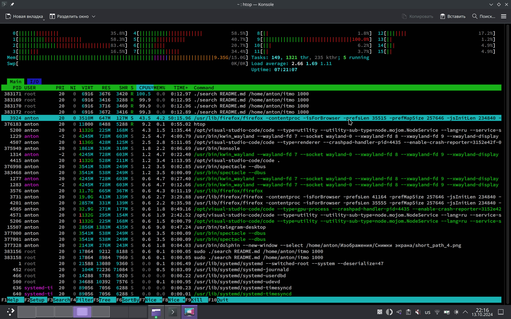
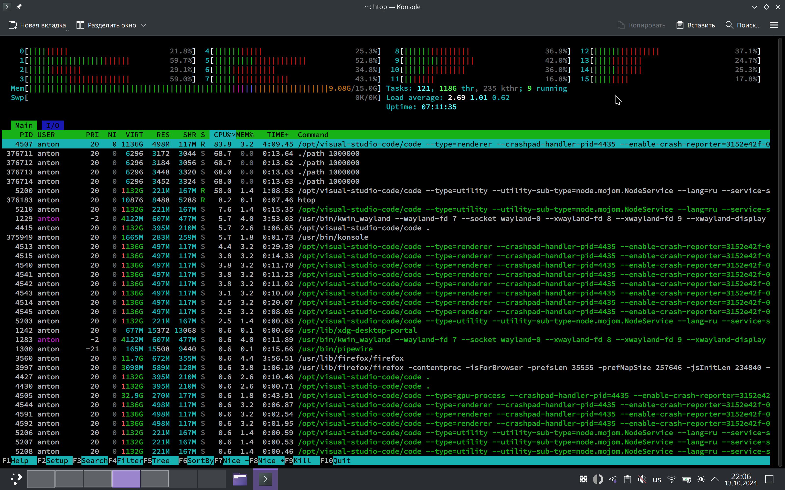

# os-course
## Часть 1. Запуск программ
[My Shell](./my_shell.cpp)
## Часть 2. Мониторинг и профилирование
### Метрики
#### search-name
```bash
$ time ./search README.md /mnt/d/ITMO 2
<programm output>
real    0m19.259s
user    0m0.307s
sys     0m0.982s


$ perf stat ./search README.md /mnt/d/ITMO 2
<programm output>
 Performance counter stats for './search README.md /mnt/d/ITMO 2':

          1,836.00 msec task-clock                       #    0.090 CPUs utilized             
           163,028      context-switches                 #   88.795 K/sec                     
               105      cpu-migrations                   #   57.189 /sec                      
               252      page-faults                      #  137.255 /sec                      
     5,788,520,519      cycles                           #    3.153 GHz                       
     2,584,809,353      instructions                     #    0.45  insn per cycle            
       589,876,534      branches                         #  321.283 M/sec                     
        23,515,246      branch-misses                    #    3.99% of all branches           

      20.429162204 seconds time elapsed

       0.250275000 seconds user
       2.261419000 seconds sys
```

#### short-path

```bash
$ time ./path 1000000
<programm output>
real    0m16.513s
user    0m5.066s
sys     0m10.784s


$ perf stat ./path 1000000
<programm output>
 Performance counter stats for './path 1000000':

         16,391.44 msec task-clock:u                     #    1.000 CPUs utilized             
                 0      context-switches:u               #    0.000 /sec                      
                 0      cpu-migrations:u                 #    0.000 /sec                      
               123      page-faults:u                    #    7.504 /sec                      
    22,903,846,694      cycles:u                         #    1.397 GHz                       
    20,288,720,550      instructions:u                   #    0.89  insn per cycle            
     3,339,997,072      branches:u                       #  203.765 M/sec                     
        90,358,936      branch-misses:u                  #    2.71% of all branches           

      16.395256523 seconds time elapsed

       4.490512000 seconds user
      11.901358000 seconds sys
```
### Запуск нескольких экземпляров
 



### Комбинированная программа
```bash
$ g++ -std=c++17 -pthread -o combined combined.cpp


$ time ./combined README.md /mnt/d/ITMO 2 1000000

real    0m21.808s
user    0m5.705s
sys     0m13.142s


 Performance counter stats for './combined README.md /mnt/d/ITMO 2 1000000':

         20,859.93 msec task-clock:u                     #    0.866 CPUs utilized             
                 0      context-switches:u               #    0.000 /sec                      
                 0      cpu-migrations:u                 #    0.000 /sec                      
               232      page-faults:u                    #   11.122 /sec                      
    25,761,022,934      cycles:u                         #    1.235 GHz                       
    21,448,069,817      instructions:u                   #    0.83  insn per cycle            
     3,615,593,438      branches:u                       #  173.327 M/sec                     
        99,669,133      branch-misses:u                  #    2.76% of all branches           

      24.079579233 seconds time elapsed

       5.743142000 seconds user
      15.944386000 seconds sys
```

### Агрессивная оптимизация
```bash
$ g++ -std=c++17 -pthread -O3 -o combined combined.cpp

$ time ./combined README.md /mnt/d/ITMO 2 1000000

real    0m23.219s
user    0m1.591s
sys     0m8.014s

$ perf stat ./combined README.md /mnt/d/ITMO 2 1000000

 Performance counter stats for './combined README.md /mnt/d/ITMO 2 1000000':

          9,863.25 msec task-clock:u                     #    0.405 CPUs utilized             
                 0      context-switches:u               #    0.000 /sec                      
                 0      cpu-migrations:u                 #    0.000 /sec                      
               236      page-faults:u                    #   23.927 /sec                      
     6,409,320,446      cycles:u                         #    0.650 GHz                       
     5,213,759,508      instructions:u                   #    0.81  insn per cycle            
     1,122,948,952      branches:u                       #  113.852 M/sec                     
        45,446,388      branch-misses:u                  #    4.05% of all branches           

      24.354725833 seconds time elapsed

       1.703641000 seconds user
       8.904496000 seconds sys
```